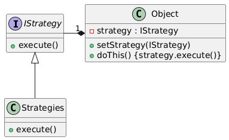
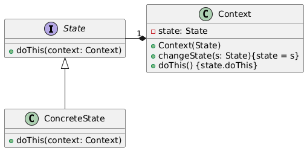

# Strategy and State Design Patterns

## 1. Strategy Pattern

### Basic Information
The **Strategy Pattern** is a behavioral design pattern that allows you to define a family of algorithms, encapsulate each one, and make them interchangeable at runtime.

It follows the **Open/Closed Principle**:
- Open for extension
- Closed for modification

Instead of using multiple conditional statements (`if`, `switch`), you delegate behavior to separate strategy classes.

---

### When to Use
Use the Strategy pattern when:

- You have multiple algorithms that perform similar tasks differently.
- You want to switch behavior at runtime.
- You want to eliminate large conditional statements.
- You want to isolate algorithm logic from the main class.

Example use cases:
- Payment processing (CreditCard, PayPal, Crypto)
- Sorting strategies
- Compression algorithms

---

### How to Use

1. Define a Strategy interface.
2. Create concrete strategy classes implementing the interface.
3. Create a Context class that holds a reference to a Strategy.
4. Allow changing the strategy dynamically.



Example (Pseudo-code):

```java
interface PaymentStrategy {
    void pay(int amount);
}

class CreditCardPayment implements PaymentStrategy {
    public void pay(int amount) { /* implementation */ }
}

class PayPalPayment implements PaymentStrategy {
    public void pay(int amount) { /* implementation */ }
}

class PaymentContext {
    private PaymentStrategy strategy;

    public void setStrategy(PaymentStrategy strategy) {
        this.strategy = strategy;
    }

    public void pay(int amount) {
        strategy.pay(amount);
    }
}
```

## 2. State Pattern

### Basic Information

The State Pattern is a behavioral design pattern that allows an object to change its behavior when its internal state changes.
The object appears to change its class by delegating behavior to different state objects.
State-specific behavior is encapsulated into separate state classes.

### When to Use

- Use the State pattern when:
- An object's behavior depends on its current state.
- You have complex conditional logic based on object state.
- State transitions are frequent and structured.
- You want to avoid large switch or if statements.

### Example use cases:

- Media player (Playing, Paused, Stopped)
- Order processing system
- Traffic light system

### How to Use

1. Define a State interface.
2. Create concrete state classes.
3. Create a Context class that maintains a reference to the current state.
4. Let state classes handle behavior and optionally change the state.



### Example (Java):

```java
interface State {
    void handle(Context context);
}

class ConcreteStateA implements State {
    public void handle(Context context) {
        System.out.println("State A behavior");
        context.setState(new ConcreteStateB());
    }
}

class ConcreteStateB implements State {
    public void handle(Context context) {
        System.out.println("State B behavior");
        context.setState(new ConcreteStateA());
    }
}

class Context {
    private State currentState;

    public Context(State state) {
        this.currentState = state;
    }

    public void setState(State state) {
        this.currentState = state;
    }

    public void request() {
        currentState.handle(this);
    }
}
```
## Key differences

| Strategy                              | State                                        |
| ------------------------------------- | -------------------------------------------- |
| Focuses on interchangeable algorithms | Focuses on object state transitions          |
| Client chooses the strategy           | State transitions usually managed internally |
| Changes *how* something is done       | Changes behavior based on internal state     |

## Summary

- Strategy = Change how an operation is performed.
- State = Change behavior when internal state changes.
- Both reduce conditional complexity and improve maintainability.
