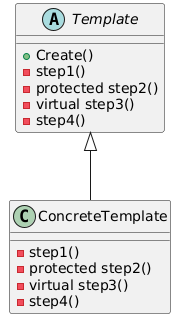

# Template Method Design Pattern

## 1. Template Method Pattern

### Basic Information

The **Template Method Pattern** is a behavioral design pattern that defines the skeleton of an algorithm in a base (usually abstract) class, while allowing subclasses to redefine certain steps of the algorithm without changing its overall structure.

It follows the **Open/Closed Principle**:
- Open for extension  
- Closed for modification  

The main idea:

> The overall algorithm structure is fixed, but some individual steps can vary in subclasses.

The template method itself is usually declared as `final` to prevent subclasses from modifying the algorithm structure.

---

### When to Use

Use the Template Method pattern when:

- Multiple classes share the same algorithm structure.
- Only certain steps of the algorithm differ between implementations.
- You want to avoid code duplication.
- You want to enforce a strict order of execution.
- You want controlled customization of parts of an algorithm.

Example use cases:
- File processing (open → process → close)
- Game loops (initialize → playTurn → checkWinner → endGame)
- Data parsing workflows
- Preparing hot drinks (boil water → add ingredient → pour → add extras)

---

### How to Use

1. Identify the algorithm with a fixed structure.
2. Create an abstract base class.
3. Implement the template method that defines the algorithm steps.
4. Mark the template method as `final` (recommended).
5. Define abstract methods for the variable steps.
6. Optionally define hook methods for optional customization.
7. Create concrete subclasses implementing the variable steps.

---

### Typical Structure

The template method usually contains different types of steps:

#### 1. Concrete (Fixed) Steps
- Fully implemented in the base class
- Shared by all subclasses
- Not meant to be overridden

#### 2. Abstract Steps
- Declared in the base class
- Must be implemented by subclasses
- Represent the variable parts of the algorithm

#### 3. Hook Methods (Optional Steps)
- Have default (possibly empty) implementations
- Subclasses may override them
- Provide additional flexibility

---



Example (Pseudo-code):

```java
abstract class AbstractProcess {

    // Template Method
    public final void execute() {
        initialize();
        requiredStep();
        optionalHook();
        finalizeProcess();
    }

    private void initialize() {
        System.out.println("Initialization step");
    }

    private void finalizeProcess() {
        System.out.println("Finalization step");
    }

    protected abstract void requiredStep();

    // Hook method
    protected void optionalHook() {
        // default empty implementation
    }
}

class ConcreteProcess extends AbstractProcess {

    @Override
    protected void requiredStep() {
        System.out.println("Concrete implementation of required step");
    }

    @Override
    protected void optionalHook() {
        System.out.println("Optional customization");
    }
}
