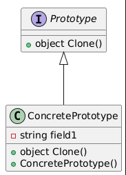

# Prototype Design Pattern

## 1. Prototype Pattern

### Basic Information
The **Prototype Pattern** is a creational design pattern that allows you to **create new objects by copying (cloning) an existing object**, instead of creating them from scratch.

This pattern is useful when object creation is **expensive**, **complex**, or requires **many configuration steps**.

Instead of repeatedly constructing a new object, you **clone a prototype instance** and modify it if necessary.

Key characteristics:
- Objects are created by **cloning an existing instance**
- Reduces **costly object creation**
- Helps when object initialization is **complex**

---

### When to Use
Use the Prototype pattern when:

- Creating an object is **expensive or time-consuming**.
- Objects have **many configuration parameters**.
- You want to **avoid subclassing for object creation**.
- You need to **create many similar objects with slight differences**.

Example use cases:
- Game objects (characters, enemies, items)
- Document templates
- Configuration presets
- UI component templates

---

### How to Use

1. Create a **Prototype interface** that declares a `clone()` method.
2. Implement this interface in **concrete classes**.
3. The `clone()` method returns a **copy of the object**.
4. The client clones the prototype instead of creating new instances directly.



Example (Pseudo-code):

```java
interface Prototype {
    Prototype clone();
}

class Document implements Prototype {

    private String title;
    private String content;

    public Document(String title, String content) {
        this.title = title;
        this.content = content;
    }

    public Prototype clone() {
        return new Document(this.title, this.content);
    }
}
